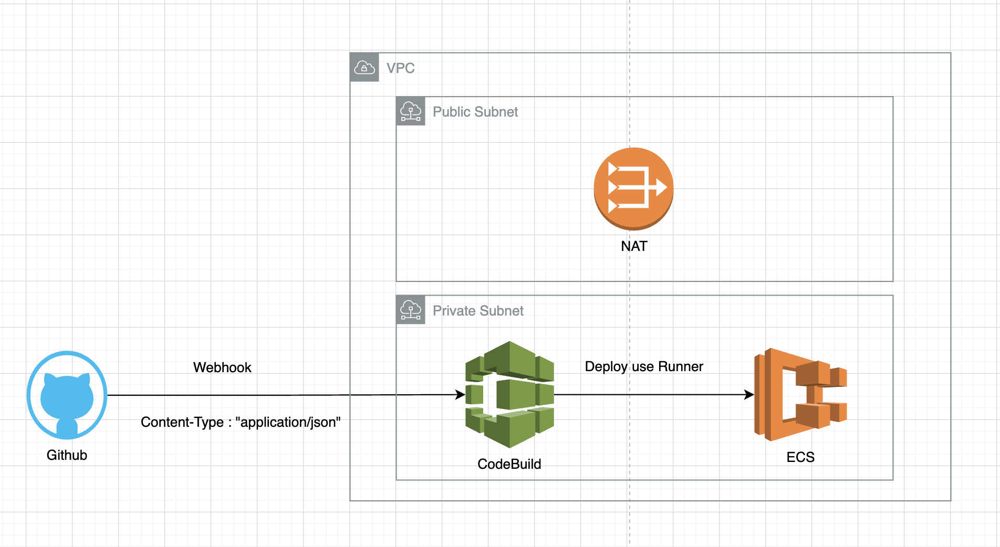
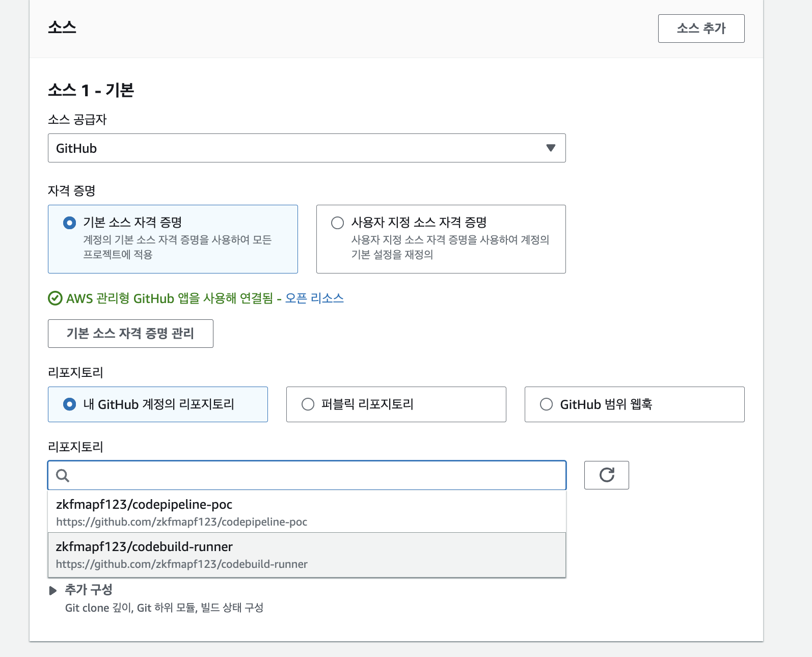
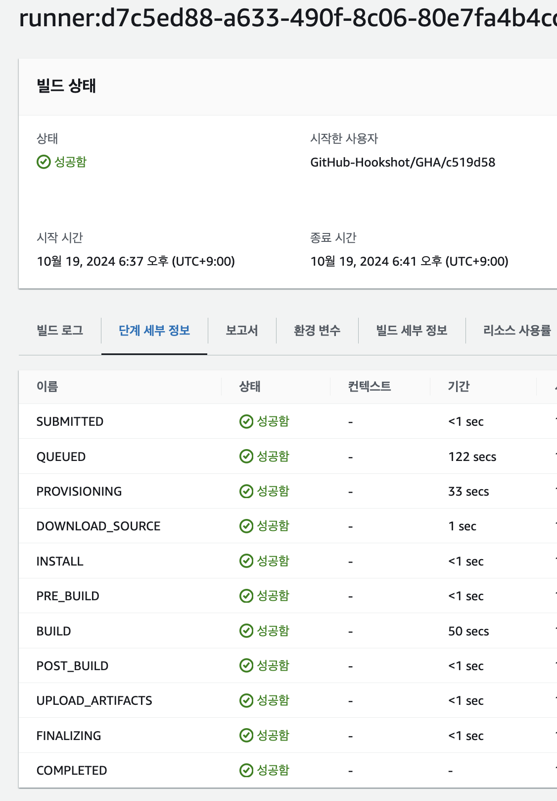
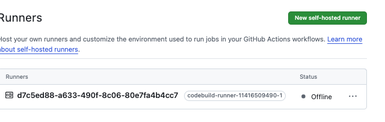

# CICD CodeBuild Architecture



## Todo...

- [x] CodeBuild와 Github Action을 통합해서 사용하기
- [x] GithubAction에서 Docker Layer Cache 검증하기
  - CodeBuild DockerLayerCached
  - Docker build --cache-from
- [ ] Terraform으로 만들기

## VPC + ALB + ECS

```sh

    cd infra
    terraform init && terraform apply --auto-approve
```

## CodeBuild + Action runner 통합하기

> CodeBuild 전용 IAM 구축

```sh
    cd infra/codebuild.iam.tf
```

> CodeBuild 구축하기 => Git Repository 연결



> CodeBuild 구축하기 => Webhook 연결하기

- Webhook을 연동하면 buildspec.yml이 아닌, Action workflows.yml을 사용하게된다.
- 완료 후 URL / Token을 활용하여 Github Webhook을 등록한다

```sh
    Content-Type: "application/json"
```

> CodeBuild 잘 동작하는지 확인하기

- master push 후 2개의 화면이 나와야 한다.
- CodeBuild 내 터미널 동작
- Github Action내 터미널 동작




## Issue

### CodeGuru Not ap-northeast-2

- CodeGuru는 아직 ap-northeast-2 리전에 출시안함...

### AccessDenied Webhooks

```sh
Access denied to connection arn:aws:codeconnections:ap-northeast-2:...:connection/a0e329d4-0479-408c-8501-e454d19374f8 Troubleshooting guide: https://docs.aws.amazon.com/codebuild/latest/userguide/connections-github-app.html#connections-github-troubleshooting
```

```json
// code-connection policy 부여

"Version" : "2012-10-17",
    "Statement" : [
      {
        "Effect" : "Allow",
        "Action" : [
          "codeconnections:GetConnectionToken",
          "codeconnections:GetConnection"
        ],
        "Resource" : [
          "*"
        ]
      }
    ]
  })
```

### Failed to create webhook. API limit...

```sh
Failed to create webhook. GitHub API limit reached or permission issue encountered when creating the webhook.
```

- Gtihub Webhook 설정진행해야 함
- <b>settings에서 Content-Type을 application/json 으로 진행해야 함</b>


- <a href="https://docs.aws.amazon.com/ko_kr/codebuild/latest/userguide/action-runner-troubleshoot-webhook.html"> webhook 문제해결 </a>