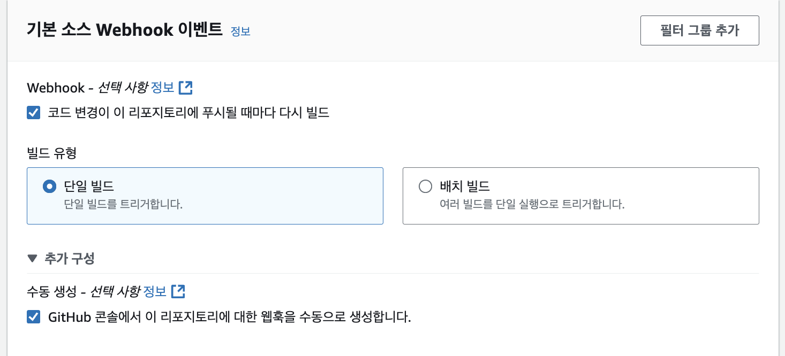
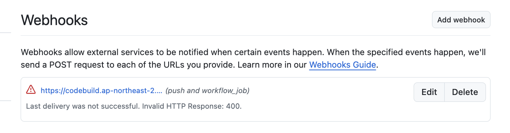

# CodeBuild Runner

## Tech / Todo...

- CodeBuild + Github Action
- Codeguru Reviewer
- Configuration Server Repository / Build Repository 
- Make Terraform

## 1. ECS + ALB 생성

- VPC는 이미 만들었음

```sh

    cd infra
    terraform init && terraform apply --auto-approve

    ## svc.leedonggyu.com 으로 통신
```

## 2. Codebuild + Runner 구성

### 만들기 전 전제조건...

- Codebuild는 Private Subnet에 위치 함 (NAT 존재해야 함)

### IAM 생성

```sh
## 해당 코드 참조
infra/codebuild.iam.tf
```

### Webhook 이벤트 정의

| 이벤트 유형 | action 값 |
|----------|----------|
| PULL_REQUESET_CREATED    | 없음     |
| PULL_REQUEST_UPDATED    | opened    |
| PULL_REQUEST_REOPENED   | reopened     |
| PULL_REQUEST_MERGED   | closed, 그리고 merged=true     |
| PULL_REQUEST_CLOSED   | closed, 그리고 merged=false     |
| WORKFLOW_JOB_QUEUED   | 대기     |
| RELEASED   | 출시     |
| PRERELEASED   | 사전 출시     |

- <a href="https://docs.aws.amazon.com/ko_kr/codebuild/latest/userguide/github-webhook-events-console.html"> CodeBuild Webhook Event Filtering </a>

## Issue

### CodeGuru Not ap-northeast-2

- CodeGuru는 아직 ap-northeast-2 리전에 출시안함...

### AccessDenied Webhooks

```sh
Access denied to connection arn:aws:codeconnections:ap-northeast-2:...:connection/a0e329d4-0479-408c-8501-e454d19374f8 Troubleshooting guide: https://docs.aws.amazon.com/codebuild/latest/userguide/connections-github-app.html#connections-github-troubleshooting
```

```json
// code-connection policy 부여

"Version" : "2012-10-17",
    "Statement" : [
      {
        "Effect" : "Allow",
        "Action" : [
          "codeconnections:GetConnectionToken",
          "codeconnections:GetConnection"
        ],
        "Resource" : [
          "*"
        ]
      }
    ]
  })
```

### Failed to create webhook. API limit...

```sh
Failed to create webhook. GitHub API limit reached or permission issue encountered when creating the webhook.
```

- Gtihub Webhook 설정진행해야 함




- <a href="https://docs.aws.amazon.com/ko_kr/codebuild/latest/userguide/action-runner-troubleshoot-webhook.html"> webhook 문제해결 </a>